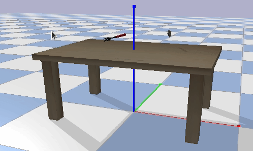
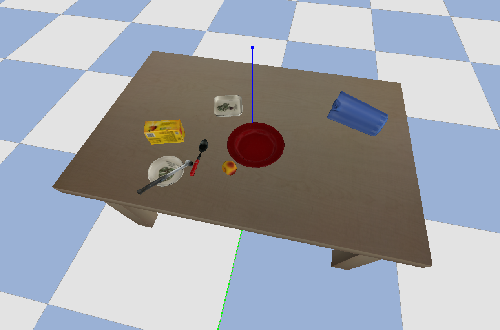

# pybullet_URDF_models
Collection of urdf models (**part of it comes from YCB dataset**).

Made for robot manipulation and grasping simulation, tested with PyBullet.


This collection contains more than **90+** daily supplies urdf models, which can be encountered in kitchen, desk, workshop and dinner scenario.

The model data follows format below:

```
urdf_models/
—— models/ 
———— fork/
—————— collision.obj
—————— model.urdf
—————— texture_map.png
—————— textured.obj
—————— textured.obj.mtl
—————— visual.ply
```

You are also welcome to add your own models under the urdf_models/models/ directory follow the same format. Nothing more needs to be done.

## Installation

Download with


```shell
git clone https://github.com/ChenEating716/pybullet-URDF-models.git 
```


Install with

```shell
pip3 install -e pybullet-URDF-models/
```


## Usage

```python
# import module
import urdf_models.models_data as md

# create model library
models_lib = md.model_list()

# get the name list of all models
print(models_lib.model_name_list)

# get the absolute path of all models in your computer
print(models_lib.model_path_list)

# find the corresponding abs path for desired model
print(models_lib['knife'])

# get random model file path
print(models_lib.random)
```


## Example







```python
import os
import time
import pybullet as p
import pybullet_data
from urdf_models import models_data
import random

# initialize the GUI and others
p.connect(p.GUI)
p.resetDebugVisualizerCamera(3, 90, -30, [0.0, -0.0, -0.0])
p.setTimeStep(1 / 240.)
p.setAdditionalSearchPath(pybullet_data.getDataPath())

# load urdf data
models = models_data.model_list()

# load model list
namelist = models.model_name_list
print("Look at what we have {}".format(namelist))

# Load table and plane
p.loadURDF("plane.urdf")
p.loadURDF("table/table.urdf")

# load the randomly picked model
flags = p.URDF_USE_INERTIA_FROM_FILE
# randomly get a model
for i in range(8):
    random_model = namelist[random.randint(0, len(namelist))] 
    p.loadURDF(models[random_model], [0., 0., 0.8 + 0.15*i], flags=flags)

p.setGravity(0, 0, -9.8)

while 1:
    p.stepSimulation()
    time.sleep(1./240)
```


## Acknowledgement

URDF models are created from the data provided by Open Cloud Robot Table Organization Challenge ([OCRTOC](http://www.ocrtoc.org/)).  All credit goes to the organizers of OCRTOC.

